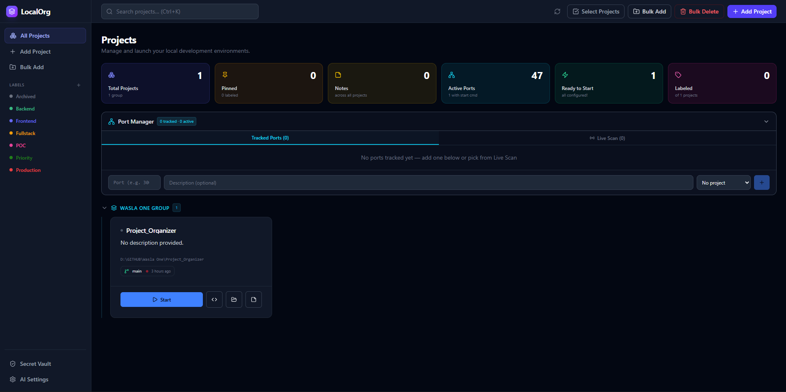

# 🚀 LocalOrg

LocalOrg is a professional, high-performance developer dashboard designed to centralize your local project management. It transforms a scattered folder of repositories into a beautiful, AI-powered command center.



## ✨ Core Features

- 🏗️ **Smart Organization**: Pin high-priority projects, group them by logical context (Work, Personal, Lab), and use professional-grade multi-selection and bulk management.
- 🔐 **Secret Vault**: A built-in, password-protected vault to store your API keys, environment variables, and sensitive credentials securely.
- 🤖 **AI Batch Analysis**: Analyze dozens of projects in seconds. Automatically detect tech stacks (Vue, React, Python, etc.), descriptions, and optimal start commands using Gemini, OpenAI, or local Ollama.
- 📝 **Rich Notes with Tagging**: Persistent project notes with custom labeling and real-time inline editing.
- 🔌 **Live Port Manager**: Real-time detection of active ports with process name identification. Never wonder what's running on port 3000 again.
- ⚡ **Performance & Scalability**: Backend powered by **SQLite** for instant loads and zero-friction setup.
- 🚀 **One-Click Launch**: Detached process management to start your dev servers and open VS Code instantly.
- 🔗 **Deep Integration**: Real-time Git status tracking (branch name, uncommitted changes, last commit time).

## 🛠️ Technology Stack

- **Frontend**: Vue 3 (Composition API), Vite, Tailwind CSS, Lucide Icons.
- **Backend**: Node.js, Express, Sequelize ORM (SQLite).
- **Tooling**: Concurrently for unified development workflows.

## 🚀 Getting Started

### 1. Installation

LocalOrg simplifies setup with a unified command:

```bash
git clone https://github.com/yourusername/LocalOrg.git
cd LocalOrg
npm run install:all
```

### 2. Development

Run both the frontend and backend with a single command:

```bash
npm run dev
```

- **Dashboard**: `http://localhost:5173`
- **Backend API**: `http://localhost:6001`

### 3. Configuration

- **Master Password**: On your first visit to the **Secret Vault**, you'll be prompted to set your master password.
- **AI Settings**: Navigate to **AI Settings** in the dashboard to configure your API keys (Gemini, OpenAI, etc.).

## 📖 Feature Highlights

### 🛡️ Secret Vault
Securely manage your sensitive strings. Whether it's a shared AWS key or a local database password, the vault keeps it hidden and copyable in one click.

### 🔌 Port Manager
Scans your system for active TCP ports and matches them to your projects. It even identifies the process name (e.g., `node.exe`, `python.exe`) so you know exactly what's eating your resources.

### 🔎 Smart Search
Use `Ctrl + K` to focus the search bar instantly. Search by project name, description, tags, or even physical disk paths.

## 📄 License

This project is licensed under the [MIT License](./LICENSE).

## 🤝 Contributing

Contributions are welcome! Please check our [CONTRIBUTING.md](./CONTRIBUTING.md) for guidelines.
